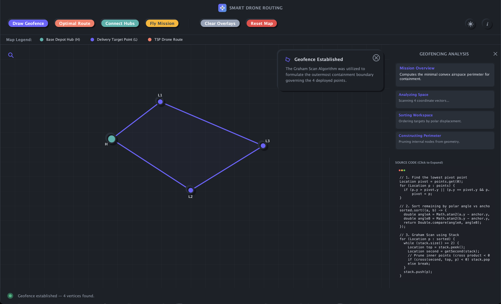
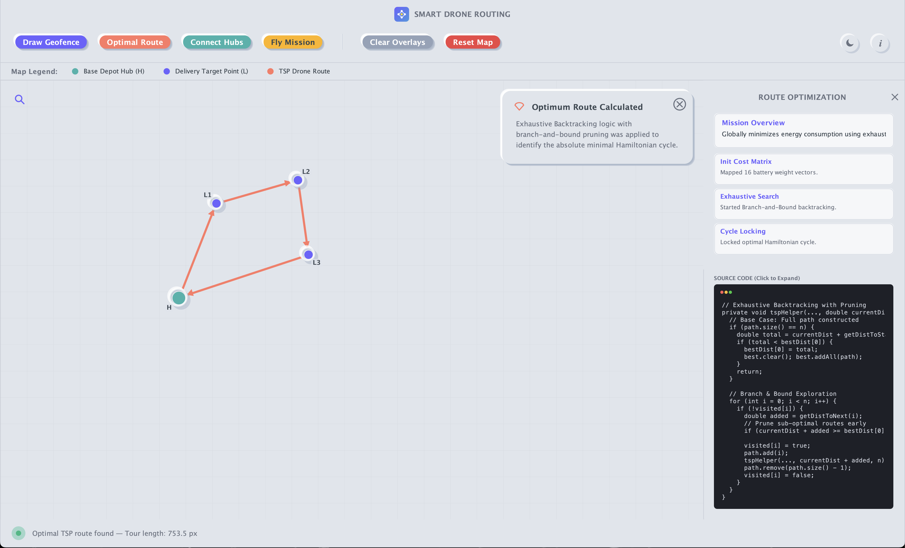
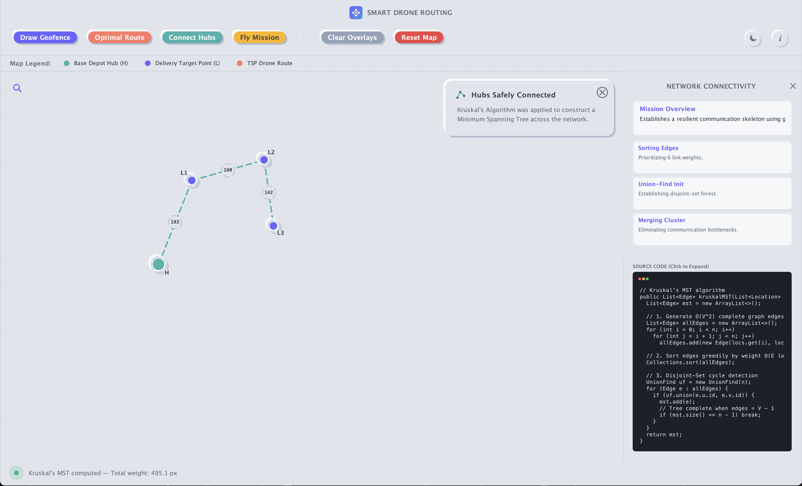
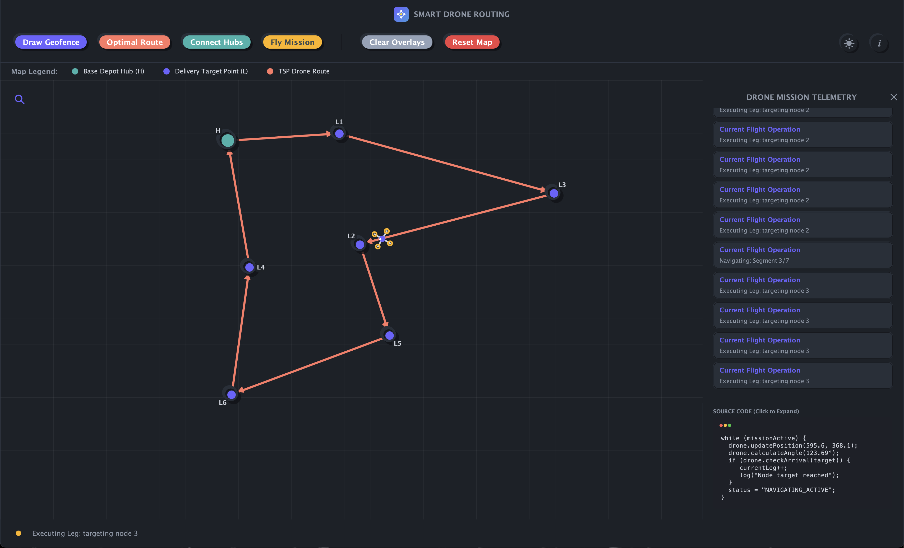

<div align="center">


<h1>Smart Drone Routing & Geofencing System</h1>

<p><b>An interactive algorithm visualization platform for autonomous drone logistics.</b><br/>
Simulate complex supply chain optimization, geofencing, and network connectivity<br/>
using advanced Design and Analysis of Algorithms (DAA) concepts.</p>

<br/>


<br/>

[](https://www.java.com/)
[](https://docs.oracle.com/javase/tutorial/uiswing/)
[-FF4B4B?style=for-the-badge)]()
[]()

</div>

---

##  &nbsp; Visualizations

<div align="center">

| Geofence (Graham Scan) | Optimal Route (TSP) | Connectivity (Kruskal's MST) |
|:----:|:-----------:|:---------:|
|  |  |  |

| Mission Control | Drone Animation | Dark Mode |
|:--------:|:--------:|:---------:|
|  |  |  |

</div>

---

##  &nbsp; Core Features

<table>
<tr>
<td width="50%">

** &nbsp; Convex Hull Geofencing**<br/>
Establishes a safe operational perimeter containing all delivery targets.

** &nbsp; Route Optimization**<br/>
Calculates the absolute shortest Hamiltonian cycle for battery conservation.

** &nbsp; Backbone Network**<br/>
Interlinks all nodes with the minimum total transmission range.

</td>
<td width="50%">

** &nbsp; Real-time Drone Telemetry**<br/>
Animated drone object executing algorithmic trajectories visually.

** &nbsp; Neumorphic GUI**<br/>
Modern, custom-painted Swing components with light/dark theme toggles.

** &nbsp; Live Source Code Inspector**<br/>
Contextual sidebar displaying the exact executing code and mission tasks.

</td>
</tr>
</table>

---

##  &nbsp; Algorithms in Detail

<details>
<summary>&nbsp;<b>1. Graham Scan (Geofencing) — <i>O(n log n)</i></b></summary>

### The Problem
When operating an autonomous drone fleet, drones must never exit authorized airspace. We need to find the outermost perimeter that safely encloses every single delivery target.

### The Implementation
The system uses the **Graham Scan** algorithm to compute the Convex Hull:
1. Identifies the lowest Y-coordinate point as the pivot (anchor).
2. Sorts all other delivery nodes by their polar angle relative to the pivot.
3. Iterates through the sorted nodes using a Stack.
4. For every new point, it checks the cross product of the vectors formed by the top two points in the stack. If it creates a "right turn" (concave), the top point is popped off (discarded from the perimeter).
5. The remaining points in the stack form the absolute minimal convex polygon.

</details>

<details>
<summary>&nbsp;<b>2. TSP Backtracking (Optimal Route) — <i>O(n!)</i></b></summary>

### The Problem
The drone needs to visit every delivery target exactly once and return to the Base Depot. Since battery life is strictly limited, we need the *absolute shortest possible path* (The Traveling Salesman Problem).

### The Implementation
Because TSP is NP-Hard, the system uses **Exhaustive Backtracking with Branch-and-Bound**:
1. Initiates a depth-first search (DFS) through all possible node permutations.
2. Tracks the `currentDistance` dynamically as the route is built.
3. **Branch and Bound Pruning:** If at any point the `currentDistance` exceeds the `bestDistance` found so far, it immediately prunes that branch and stops exploring.
4. Returns the globally optimal Hamiltonian cycle.

</details>

<details>
<summary>&nbsp;<b>3. Kruskal's MST (Connectivity) — <i>O(E log E)</i></b></summary>

### The Problem
In scenarios where continuous ground-to-drone sensor connectivity is prioritized, the system needs to interlink all nodes to the Base Depot using the minimum possible transmission range.

### The Implementation
The system constructs a **Minimum Spanning Tree (MST)** using **Kruskal's Algorithm**:
1. Generates a complete graph by linking every node to every other node.
2. Sorts all possible edges by distance (weight) in ascending order.
3. Iterates through the sorted edges and uses a **Disjoint-Set (Union-Find)** data structure.
4. If adding an edge connects two disjoint clusters without forming a cyclic loop, it is added to the network.
5. Halts exactly when `V - 1` edges are collected, ensuring a perfect skeleton network.

</details>

---

##  &nbsp; Tech Stack

<div align="center">

|  | Technology | Usage |
|--|----------|---------|
| **Core Language** | Java (JDK 17+) | Primary runtime environment |
| **GUI Framework** | Java Swing & AWT | Custom rendering, Neumorphism, animations |
| **Graphics** | Graphics2D / AffineTransform | Vector drawing, canvas zooming/panning |
| **Algorithms** | Custom DAA Implementations | TSP, Graham Scan, Kruskal's MST, Union-Find |
| **Concurrency** | SwingWorker & Timers | Non-blocking algorithm execution & drone animation |

</div>

---

##  &nbsp; Project Structure

```text
smart-drone-routing/
│
├── src/
│   ├── DroneMapUI.java           ← Main application frame, Navbar, and layout
│   ├── DroneMapPanel.java        ← Canvas, 2D graphics, drone animations, mapping
│   ├── AlgorithmManager.java     ← Core logic (Graham Scan, TSP, Kruskal)
│   ├── AlgorithmSidebar.java     ← Mission status, task list, live code terminal
│   ├── Location.java             ← Node coordinate data structure
│   ├── Edge.java                 ← Weighted edge for Kruskal's
│   ├── UnionFind.java            ← Disjoint-set data structure
│   └── Theme.java                ← Colors, Dark/Light mode state
│
├── assets/
│   ├── logo.svg
│   ├── icons/
│   └── screenshots/
│
└── README.md
```